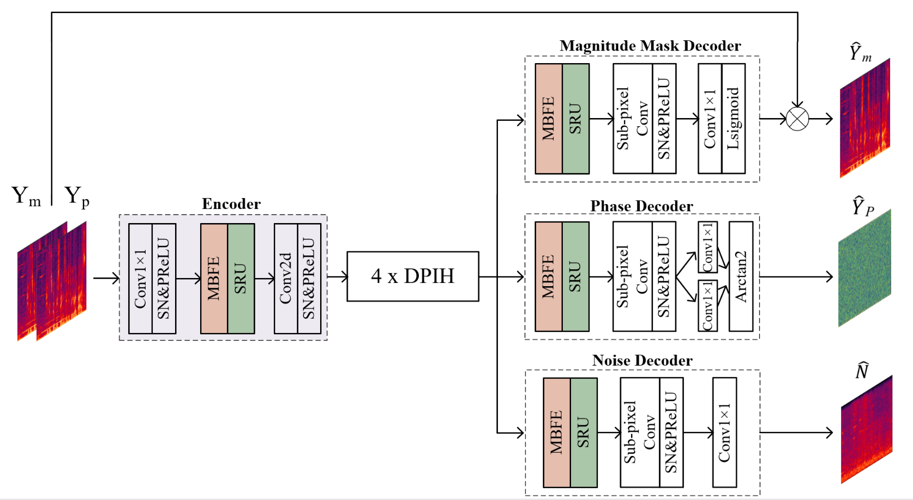

# MN-Net: Speech Enhancement Network Via Modeling the Noise
The architecture of MN-Net:
 
[1] Y. Hu et al., "MN-Net: Speech Enhancement Network via Modeling the Noise," in IEEE Transactions on Audio, Speech and Language Processing, vol. 33, pp. 1208-1219, 2025, doi: 10.1109/TASLPRO.2025.3546819.
